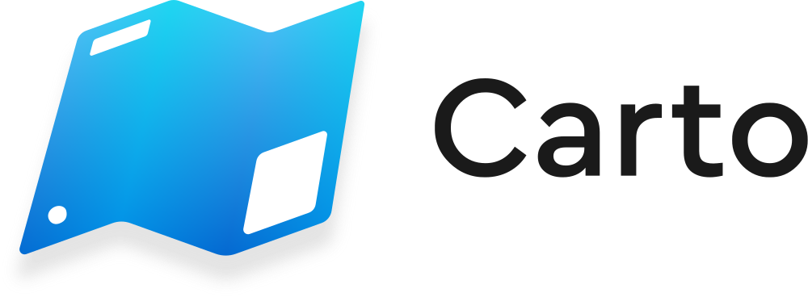

    <picture>
        <source media="(prefers-color-scheme: dark)" srcset="./Documentation/Banner-Dark.png">
        <source media="(prefers-color-scheme: light)" srcset="./Documentation/Banner-Bright.png">
        
    </picture>

# Carto

**Carto** is a Cities: Skylines II mod designed to extract in-game spatial data and convert it into widely used geospatial file formats.

## Features

* **Vector data export** – Export buildings, districts, map tiles, pathways, POIs, roads, routes, tracks, zoning cells, and more.
* **Raster data export** – Export terrain elevation and water depth.
* **Attribute-rich output** – Includes object attributes such as names, direction, and other metadata.
* **Multiple file formats** – Supports GeoJSON and ESRI Shapefile for vector data; GeoTIFF for raster data.
* **Projection support** – Uses WGS84 / UTM (EPSG: 326xx / 327xx) by default. Custom Transverse Mercator projections are also supported.

## Installation

Carto is available exclusively via [Paradox Mods](https://mods.paradoxplaza.com/mods/87428/Windows), the official distribution platform. You can install it through the in-game mod browser, their website, or via [Skyve](https://github.com/JadHajjar/Skyve).

## Getting Started

1. Load a save, start a new game, or open the editor.
2. Open **Options** and select **Carto** from the sidebar.
3. In the **General** tab, choose file format and output name.
4. Select data types to export in the **Feature** tab.
5. Configure geometry and attributes in the **Properties** tab.
6. Set your projection in the **Projection** tab.
7. Click **Export Files** in the **General** tab.
8. Your data will be saved to: `C:\Users\<YourName>\AppData\LocalLow\Colossal Order\Cities Skylines II\ModsData\Carto`

See the [Tutorials](https://github.com/taipei-native/Carto/wiki/Tutorial) for making maps with QGIS, and the [User Manual](https://github.com/taipei-native/Carto/wiki) for detailed documentation.

## API Integration

Carto exposes a public API at `Carto.IO.IO.Export(Carto.IO.Options)` so other mods can drive exports on their demand. For the detailed documentation, please refer to the [API guide](https://github.com/taipei-native/Carto/wiki/Api).

## Credits

Since April 2024, when I started to develop Carto, I’ve learned from and been inspired by the open-source work of amazing Cities: Skylines II modders including **algernon**, **Guo**, **krzychu124**, **TDW**, and **yenyang** — a big shout-out to them!

Special thanks also to beta testers like **Allegretic**, **Excellent Guy**, **jefferyharrell**, **LightLight**, and members of the *Cities: Skylines Modding* and *Cities: Skylines Taiwan Assets* Discord servers for their feedback and support.

Carto also includes C# adaptations of parts of [PROJ](https://github.com/OSGeo/PROJ) and [PROJ4JS](https://github.com/proj4js/proj4js), optimized for Unity’s Burst compiler. License details are available in the `Licenses` directory.

Finally, sincere thanks to everyone who contributed translations on [Crowdin](https://crowdin.com/project/carto):

* Dutch: **GeraspteGatenKaas**
* French: **Morgan · Toverux** and **Wateir**

## Contact

You can reach out via:

* [Paradox Forum](https://forum.paradoxplaza.com/forum/threads/carto.1699089/) (English / Chinese)
* [Cities: Skylines Modding Discord](https://discord.gg/HTav7ARPs2) (English)
* [Cities: Skylines Taiwan Assets Discord](https://discord.gg/Gz4K66jT64) (Chinese preferred)

For bug reports or in-depth discussions, please use [GitHub Issues](https://github.com/taipei-native/Carto/issues) or [Discussions](https://github.com/taipei-native/Carto/discussions) to keep things organized.

## License

This project is licensed under the MIT License. See [LICENSE.txt](LICENSE.txt) for full details.
